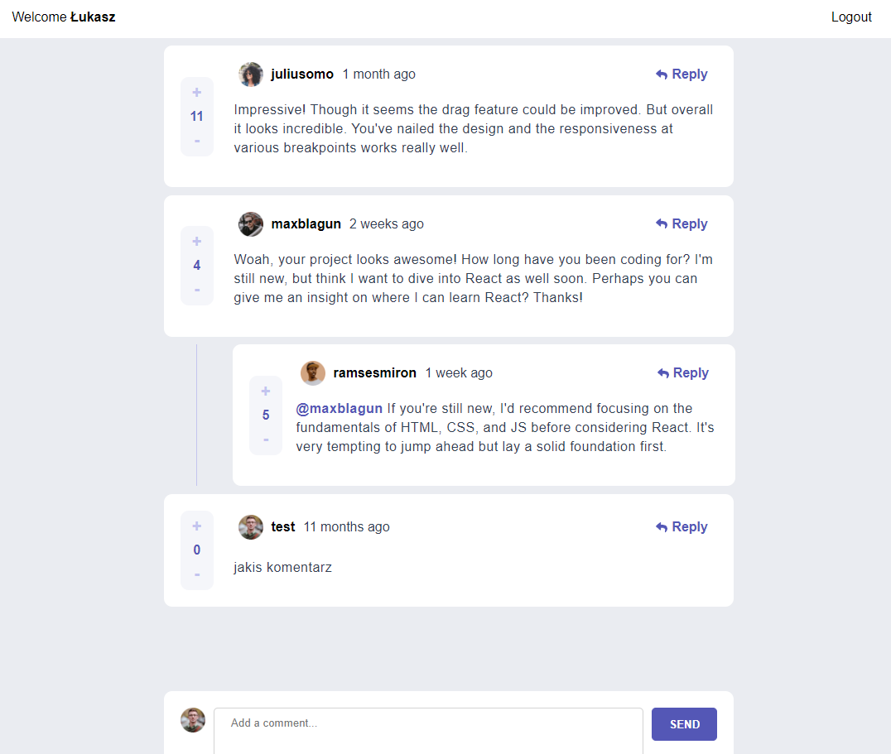

# Interactive Comments Section

> A project that involves an interactive comments section, allowing users to perform CRUD operations on comments and replies. The design aims for responsiveness across various screen sizes and incorporates hover states for interactive elements. Comments and replies feature upvoting/downvoting functionality and utilize `localStorage` for state persistence. Additionally, dynamic timestamps are employed for comment and reply creation. The comment system and rating functionality are stored and managed within Firebase, providing a scalable and real-time database solution. Firebase authentication enables user register and login functionality.
> Live demo [_here_](https://lukass9.github.io/interactive-comments-section/).

### Features

- Responsive layout for different screen sizes
- Hover states for interactive elements
- CRUD operations for comments and replies
- Upvoting and downvoting comments
- Utilization of `localStorage` to persist state
- Dynamic timestamp functionality for comment and reply creation
- Firebase integration for comments and rating system
- Firebase authentication for user login

### Expected Behavior

- First-level comments sorted by score; nested replies sorted by time
- New replies added to the bottom of nested replies within a comment
- Confirmation modal before deleting comments or replies
- Limited editing and deletion to one's own comments and replies

## Technologies Used

- React - version 18.2.0
- TypeScript - version 4.9.5
- Framer Motion - version 10.6.0
- Styled Components - version 5.3.6
- Firebase - version 9.15.0

## Screenshots

### Desktop

### Mobile

#### signIn/signUp

 

#### Reply

## Setup and Usage

- Clone the repository
- Install dependencies with `npm install` or `yarn install`
- Run the application locally with `npm start start` or `yarn start start`
- Visit [localhost](http://localhost:3000) in your browser to view the application

## Contact

Created by [@Lukass9](https://github.com/Lukass9) - Feel free to reach out!
